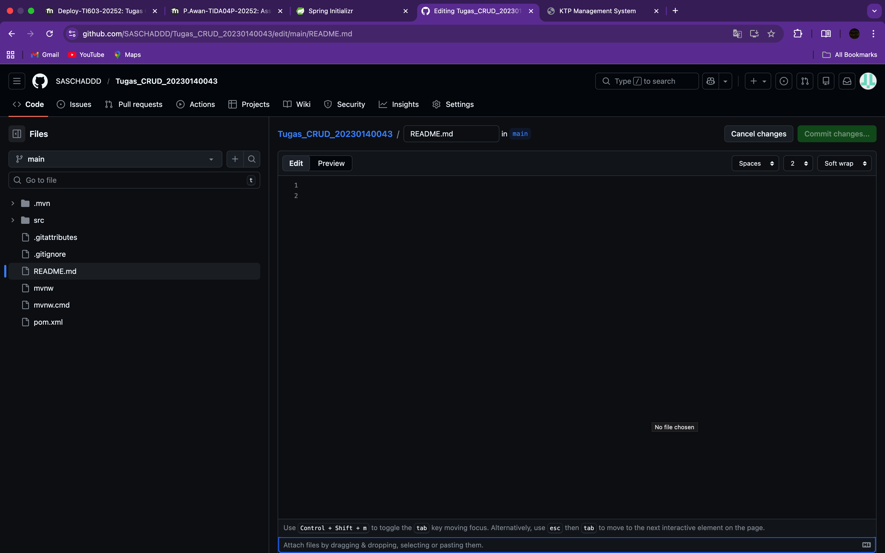

# KTP Management System

Sistem manajemen KTP modern menggunakan Spring Boot 3 dan MySQL.

## Tampilan Aplikasi (Screenshots)

Berikut adalah dokumentasi visual dari implementasi KTP Management System:

### UI Dashboard & Form


### Proses Input & Validasi


### Operasi CRUD (Edit/Delete)


### Verifikasi Akhir



## Struktur Project (Complete Package - 9 Packages)

Proyek ini mengikuti struktur paket yang sangat lengkap sesuai persyaratan:

1. **`controller`**: `KtpController.java` - Menangani HTTP Request.
2. **`service`**: `KtpService.java` - Interface logika bisnis.
3. **`service.impl`**: `KtpServiceImpl.java` - Implementasi logika bisnis.
4. **`repository`**: `KtpRepository.java` - Layer akses data (Spring Data JPA).
5. **`entity`**: `KtpEntity.java` - Objek Persistence (JPA Entity).
6. **`model`**: `Ktp.java` - Objek Domain Model.
7. **`dto`**: `KtpDto.java` - Objek Data Transfer untuk API.
8. **`mapper`**: `KtpMapper.java` - Komponen konversi (Entity <-> Model <-> DTO).
9. **`util`**: `KtpUtil.java` - Konstanta dan utilitas sistem.

## Alur Data
`Request -> Controller -> Service -> Mapper -> Model -> Mapper -> Entity -> Repository -> MySQL`

## Teknologi
- **Backend**: Spring Boot 3.2.5, Spring Data JPA, Lombok.
- **Frontend**: Glassmorphism UI (HTML/CSS), JQuery Ajax.
- **Database**: MySQL.

## Cara Menjalankan
1. Sesuaikan konfigurasi database di `src/main/resources/application.properties`.
2. Jalankan aplikasi:
   ```bash
   ./mvnw spring-boot:run
   ```
3. Akses di `http://localhost:8080/`.

## Dokumentasi API

Seluruh endpoint mengembalikan data dalam format JSON.

### 1. Ambil Semua Data
- **Endpoint**: `GET /ktp`
- **Deskripsi**: Mengambil seluruh daftar penduduk.

### 2. Tambah Data Baru
- **Endpoint**: `POST /ktp`
- **Payload**:
  ```json
  {
    "nomorKtp": "1234567890123456",
    "namaLengkap": "John Doe",
    "alamat": "Jl. Merdeka No. 1",
    "tanggalLahir": "1990-01-01",
    "jenisKelamin": "Laki-laki"
  }
  ```

### 3. Hapus Data
- **Endpoint**: `DELETE /ktp/{id}`
- **Respon Sukses**: `{"message": "Data berhasil dihapus!"}`

---
*Dibuat oleh Antigravity.*
